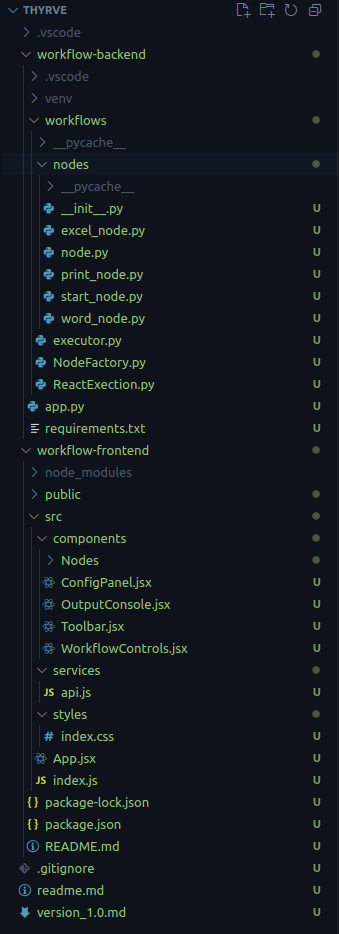
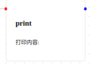
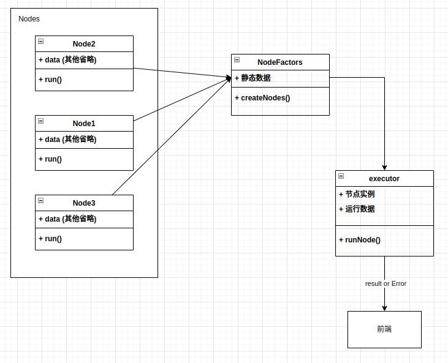

```shell
.
├── workflow-backend
│   ├── app.py
│   └── workflows
│       ├── executor.py
│       ├── NodeFactory.py
│       ├── nodes
│       │   ├── excel_node.py
│       │   ├── node.py
│       │   ├── print_node.py
│       │   ├── start_node.py
│       │   └── word_node.py
│       └── ReactExection.py
└── workflow-frontend
    ├── package.json
    ├── package-lock.json
    ├── public
    │   ├── index.html
    │   └── manifest.json
    └── src
        ├── App.jsx
        ├── components
        │   ├── ConfigPanel.jsx
        │   ├── Nodes
        │   │   ├── ExcelNode.jsx
        │   │   ├── index.js
        │   │   ├── LoopNode.jsx
        │   │   ├── printNode.jsx
        │   │   ├── Start.jsx
        │   │   └── WordNode.jsx
        │   ├── OutputConsole.jsx
        │   ├── Toolbar.jsx
        │   └── WorkflowControls.jsx
        ├── index.js
        ├── services
        │   └── api.js
        └── styles
            └── index.css
```

简化后的文件目录如上图所示(去掉了python虚拟环境,React依赖包以及无关的日志文件)

完整项目目录:


## 前端

### 概述

- `package.json`, `package-lock.jason`和`public`是相关依赖项和公共数据,比如`index.html`是前端部分的总入口.

```shell
src
├── App.jsx
├── components
│   ├── ConfigPanel.jsx
│   ├── Nodes
│   │   ├── ExcelNode.jsx
│   │   ├── index.js
│   │   ├── LoopNode.jsx
│   │   ├── printNode.jsx
│   │   ├── Start.jsx
│   │   └── WordNode.jsx
│   ├── OutputConsole.jsx
│   ├── Toolbar.jsx
│   └── WorkflowControls.jsx
├── index.js
├── services
│   └── api.js
└── styles
    └── index.css

```

这里是项目的开发目录.`services`目录下的`api.js`文件是负责通讯的部分.`styles`为前端样式文件.

`components`下是文件的主要的组建部分.

- `App.jsx`是组建的总入口

- `Nodes`中是各个节点的详细数据.其中`index.js`是全部节点的一个汇总
- `OutputConsole.jsx`是下方通知栏
- `Toolbar.jsx`是React自带的部分组建的使用
- `WorkflowControls.jsx`是按钮的作用.

其中,有较大修改的部分是`App.jsx`, `Nodes`部分文件, `OutputConsole.jsx`

### Nodes文件夹

`index.js`

```javascript
import ExcelNode from './ExcelNode';
import WordNode from './WordNode';
import startNode from './Start';
import printNode from './printNode';
import LoopNode from './LoopNode';
export const nodeTypes = {
  excel: ExcelNode,
  word: WordNode,
  start: startNode,
  print: printNode,
  loop: LoopNode,
};

export const nodeConfigs = {
  excel: {
    type: 'excel',
    label: 'Excel操作',
    configs: [
      { key: 'filename', label: '文件名', type: 'input' },
      { 
        key: 'operation', 
        label: '操作', 
        type: 'select',
        options: [
          { value: 'read', label: '读取' },
          { value: 'write', label: '写入' },
          { value: 'sum', label: '求和' },
        ]
      }
    ]
  },
  word: {
    type: 'word',
    label: 'Word操作',
    configs: [
      { key: 'filename', label: '文件名', type: 'input' },
      { key: 'content', label: '内容', type: 'textarea' }
    ]
  },

  start: {
    type:'start',
    label: 'start节点',
    configs: [] 
  },

  print:{
    type: 'print',
    label: 'print操作',
    configs: [
      { key: 'content', label: '内容', type: 'input' },
    ]
  },
  loop:{
    type: 'loop',
    label: '循环节点',
    configs: [
      { key: 'Loopcnt', label: '循环次数', type: 'input' },
    ]
  }
};
```

这里将展示各个节点的内容,是负责将你写的节点添加进前端页面的入口.

每一个节点的内容都大致不差,比如这里的`printNode.jsx`

```typescript
import React from 'react';
import { Handle } from 'reactflow';

const printNode = ({ data }) => {
  return (
    <div className="node-container">
      
      <Handle id="workflow_input" type="target" position="left" style={{ background: 'red', top: 20, }} />
      <Handle id="workflow_output" type="source" position="right" style={{ background: 'blue', top: 20, }} />
      

      <div className="node-content">
        <h4>print</h4>
        <div className="node-details">
          <p>打印内容: {data.content}</p>
        </div>
      </div>
    </div>
  );
};

export default printNode;
```

关于节点的内容,我们需要关系的一个点就是传入后端的时候的数据是什么样子的.这里来看看原始的数据.

```shell
INFO:__main__:
Workflow data: 
{
'nodes': [
{'id': 'start-1745643293076', 'type': 'start', 'position': {'x': 32, 'y': 259}, 'data': {'label': 'start node'}, 'width': 172, 'height': 103, 'selected': False, 'positionAbsolute': {'x': 32, 'y': 259}, 'dragging': False}, {'id': 'print-1745643293540', 'type': 'print', 'position': {'x': 228, 'y': 279}, 'data': {'label': 'print node', 'content': 'Hello'}, 'width': 172, 'height': 133, 'selected': True, 'positionAbsolute': {'x': 228, 'y': 279}, 'dragging': False}
], 
'edges': [
{'source': 'start-1745643293076', 'sourceHandle': 'workflow_output', 'target': 'print-1745643293540', 'targetHandle': 'workflow_input', 'id': 'reactflow__edge-start-1745643293076workflow_output-print-1745643293540workflow_input'}
]
}
```

每次前端传入文件向后端的时候,会传入一个字典, 字典有两个键值对,一个是`'node':[]`一个是`'edges':[]`

看这里的`'data'`, 就是我们关心的数据, 而在上面的printNode中传入的data数据, 以及`data.content`就体现在了这里,也就是说,后端使用的数据就取决于你的jsx文件中如何使用这个data的变量.而这个`content`是哪里来的呢?

`index.js`

```javascript
print:{
    type: 'print',
    label: 'print操作',
    configs: [
      { key: 'content', label: '内容', type: 'input' },
    ]
  },
```

在这里.

> [!NOTE]
>
> 这里有一个问题, 如果你的node里面对应的一栏没有填写东西,比如这样:
>
> 
>
> 的时候, 传回去的data里面不会有content的键值对, 后端就会出错.
>
> 这里前端可以稍微处理一下(后端已处理响应的异常)

### OutputConsole.jsx

文件设置了一个函数, `Log()`, 将`const Log = (message, type = "info");`挂载在window下(全局函数), 其中type是设置通知等级, 有下面三种:

```jsx

  const getLogColor = (type) => {
    switch(type) {
      case 'error': return 'red';
      case 'warning': return 'orange';
      case 'info': return 'blue';
      default: return 'black';
    }
  };
```

用来设置不同的通知效果.

其中, 在`App.jsx`中的`workflow-area`div下挂载.

```jsx
<div className="workflow-area">
        <WorkflowControls
          onStart={handleStart}
          onSave={handleSave}
          onLoad={handleLoad}
        />
        <ReactFlow
          nodes={nodes}
          edges={edges}
          onNodesChange={onNodesChange}
          onEdgesChange={onEdgesChange}
          onNodesDelete={onNodesDelete}
          onEdgesDelete={onEdgesDelete}
          onConnect={onConnect}
          onDrop={onDrop}
          onDragOver={onDragOver}
          onNodeClick={onNodeClick}
          nodeTypes={nodeTypes}
          deleteKeyCode={['Delete']} // 支持Delete和Backspace键删除
          /////////////////////////////////////////////////////////////////

          // zhang ruixin added this code to validate the connection

          isValidConnection={isValidConnection}
        /////////////////////////////////////////////////////////////////
        >
          <Background />
          <Controls />
        </ReactFlow>
        <OutputConsole />  
      </div>
```

### App.jsx

 相比第一版,主要修改了bug,并且添加了两个功能, 一个是前面的通知栏, 一个是handle的匹配逻辑, 同时修改了前端传递信息的逻辑, 所以只需要关注下面的两个部分.

```jsx

  /////////////////////////////////////////////////////////////////
  // Zhang Ruixin added this code to validate the connection
  // 设计了一个兼容表 
  // 如果类型相同 那么可以连接
  // 否则不能连接
  // 后续解决可能需要使用正则表达式

  const validConnectionMap = {
    'workflow_output': ['workflow_input'],
    'workflow_input': ['workflow_output'],
    'workflow_output_loopbody': ['workflow_input'],
  };
  const isValidConnection = useCallback(
    ({ source, target, sourceHandle, targetHandle }) => {
      // window.Log(`source: ${source}, target: ${target}, sourceHandle: ${sourceHandle}, targetHandle: ${targetHandle}`, 'info');

      // 如果不匹配 那么直接删除
      if (!validConnectionMap[sourceHandle]?.includes(targetHandle)) {
        return false;
      }
      // 对于workflow_output 不能重复连接 但是workflow_input也许可以重复连接
      const targetAlreadyConnected = edges.some(
        edge => edge.source === source
          && edge.sourceHandle === 'workflow_output'
      );
      return !targetAlreadyConnected;
    },
    [edges]
  );
```

和 

```jsx

  const handleStart = async () => {
    try {
      window.Log('开始执行', 'info');
      // 获取全部的节点 准备发送
      const workflow = { nodes, edges };
      const result = await executeWorkflow(workflow);
      // 值的一提 这里的result是个response对象 其构成为
      // {
      //   data: {
      //     .....
      //   },
      //   status: 200,
      //   statusText: 'OK',
      //   headers: {...},
      //   config: {...},
      //   request: {...}
      // }
      // data里面才是返回的结果 其他的都是自动的处理
      // 比如我python里面返回的是return jsonify({"status": "success", "data": result})
      // 那么这里的result就是的 data：{{"status": "success", "data": result}}
      console.log(result)
      if (result.data["status"] === 'error') {
        window.Log(`执行失败: ${result.data["message"]}`, 'error');
      } else {
        window.Log(`执行成功`, 'info');
        // 遍历 result.data["data"] 数组并打印每个元素的第二个值
        result.data["data"].forEach(item => {
          for (let key in item) {
            if (item.hasOwnProperty(key)) {
                window.Log(`${key}: ${item[key]}`, 'info');
            }
          }
        });
      }
    } catch (error) {
      // 这里一般是不会调用的 如果发生了 说明代码出错了 或者接口返回了错误
      // 因为返回值中是存在status字段的
      window.Log(`执行失败: ${error.message}`, 'error');
      window.Log(`错误详情: ${error.response?.data}`, 'error');
    }
  };

```

先说第一个部分,这里是通过每一个node的handle的唯一id, 通过设置一个匹配表来实现响应的匹配.连接的时候, 如果不匹配, 那么直接删除.

第二个部分就是负责通讯, 将当前工作区域的json文件提取, 直接整个发送即可. 并且等待后端发送result返回.

## 后端

### 概述

```shell
├── workflow-backend
│   ├── app.py
│   └── workflows
│       ├── executor.py
│       ├── NodeFactory.py
│       ├── nodes
│       │   ├── excel_node.py
│       │   ├── node.py
│       │   ├── print_node.py
│       │   ├── start_node.py
│       │   └── word_node.py
│       └── ReactExection.py
```

- `app.py`是文件的入口
- `exector.py`是处理节点运行逻辑的文件. 主要包含了节点的动态属性.
- `NodeFactory.py` 是一个近似的工厂模式, 主要包含静态信息(也就是前端传回来的json信息)
- `nodes`中是各个节点的数据.
- `ReactExection`中是异常数据.

大致逻辑如下:



### exector

`exector`的逻辑是: 每一次前端发送处理申请, 生成一个execotr进行操作.

首先,exector在初始化的时候会对前端的json进行处理,生成对应的邻接表,id映射等等,并且全部传入factories中.

接着就会开始运行, 首先找到起始节点,然后执行节点,每一个节点在第一次遇到的时候通过工厂生成其实例, 然后开始运行节点, 节点在运行的时候就会更新下一个节点位置. 节点运行完成后, 就控制权移交exector, 然后exector根据当前节点更新的下一个节点找到下一个节点开始运行.

核心代码如下:

```python
def execute_node(self, node_id):
        logger.info(f"Executing node: {node_id}")
        cur_node = self.node_instances[node_id]
        result = cur_node.run()
        next = cur_node.get_next()
        in_handle = cur_node.get_in_handle()
        return result,next,in_handle

    def execute(self):
        try:
            logger.info("Starting workflow execution")
            
            
            # 开始按照顺序执行节点
            cur_node = self.factory.find_start()
            next_node = "__WHU__"
            in_handle = "__WHU__"


            while next_node is not None:
                # 判断当前节点是否被实例化
                print("cur_node:",cur_node)
                if cur_node not in self.node_instances:
                    self.node_instances[cur_node] = self.factory.create_node_instance(cur_node)
                result,next_node,in_handle = self.execute_node(cur_node)
                
                self.results.append({cur_node:result})

                cur_node = next_node

            return {"status": "success", "data" : self.results}
  
        except ReactError as e:

            if e.type == 1:
                logger.error(f"Error: {str(e)}")
                return {"status": "error", "message": "error type 1: There are multiple start nodes in the workflow"}
            elif e.type == 2:
                logger.error(f"Error: {str(e)}")
                return {"status": "error", "message": "error type 2: There is no start node in the workflow"}
            elif e.type == 3:
                logger.error(f"Error: {str(e)}")
                return {"status": "error", "message": f"error type 3: Unknown node type: {e.args[0]}"}
            elif e.type == 4:
                logger.error(f"Error: {str(e)}")
                return {"status": "error", "message": f"error type 4: {e.args[0]} content error"}
            
```

### nodes

每一个节点的基类如下:

```python
from abc import ABC, abstractmethod
from typing import final

class Node(ABC):
    def __init__(self, id, type, next_data, node_data):
        """
        初始化节点的基本属性。

        :param _id: 每个节点的唯一标识符，用于区分不同的节点。
        :param _type: 节点的类型，决定节点的行为和特性。
        :param _next_data: 邻接节点的数据，通常用于图或链表结构。
        :param _node_data: 节点的运行数据，保存节点的状态信息或计算结果。
        :param _in_handle: 表示节点上一次是从哪里进入的
        """
        self._id = id
        self._type = type
        self._next_data = next_data
        self._node_data = node_data
        self._next_node = None
        self._in_handle = None

    @abstractmethod
    def run(self):
        """
        执行节点的操作。

        这是一个抽象方法，具体的节点操作将在子类中定义。
        每个节点的运行逻辑应该在这个方法中实现。
        """
        pass
    

    @final
    def get_next(self):
        '''
        :result 返回节点的下一个执行的节点 如果没有下一个 那么设为None
        '''
        return self._next_node
    
    @final
    def get_in_handle(self):
        '''
        :result 返回节点的上一次是从哪里进入的 如果没有上一个进入的节点(start) 那么设为None
        '''
        return self._in_handle
```

根据不同节点的属性重写对应的run函数和初始化函数即可.

### NodeFactory

核心功能还是创造节点

```python
  def create_node_instance(self, node_id):
        try:
            node = self.nodes_map[node_id]
            print("Create_node_instance :",node_id)
            return self.__create_node(node['type'], node_id, self.adjacency[node_id],self.nodes_map[node_id])
            
        except ReactError as e:
            logger.error(f"Error creating node instance: {str(e)}")
            raise e

    def __create_node(self, type, node_id, node_next_data, data):
        """
        根据节点类型创建节点。

        :param node_type: 字符串，表示节点的类型。
        :raises ReactError: 如果节点类型未知，则抛出异常。
        :return: 创建的节点对象。

        创建节点的过程根据传入的 `node_type` 参数来判断。
        """
        match type:
            case "start":
                return StartNode(node_id, node_next_data, data)
            case "print":
                return PrintNode(node_id, node_next_data, data)
            case _:
                raise ReactError(3, f"Unknown node type: {type}")
            
```

