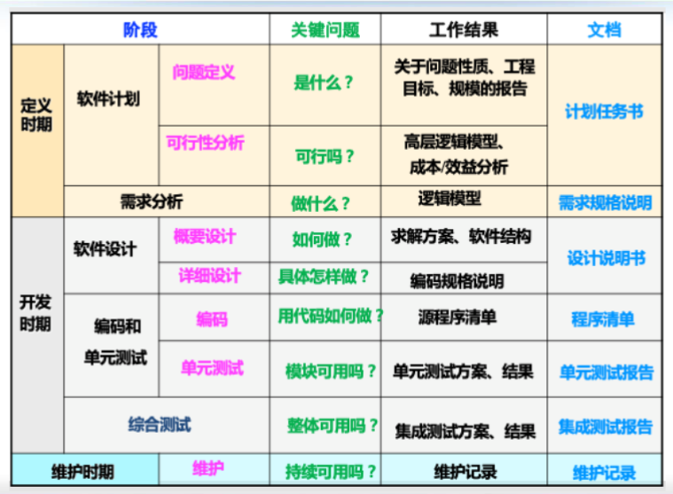

[TOC]

> [!IMPORTANT]
>
> - 软件工程的第一要义是先把东西做出来
>
> - 大部分的错误都是编码之前造成的。
>
> - 错误发现的越早，代价越低。

## 软件的生命周期

### 定义时期

#### 计划分析

> > 计划任务书

- 问题定义：软件是什么？
  这个软件的目的是什么？（解决一个什么问题）问题的规模多大？（针对社区大小?个人产品？上市产品？）
- 可行性分析: 能做出来吗?做出来有收益吗？
  模型，分析

#### 需求分析

> > 需求规格说明

​	要做什么？要解决什么问题？

### 开发时期

#### 软件设计

> > 设计说明书

- 概要设计/系统设计：这一层次是比较高级层次的设计。要关注的是整体的解决方案，例如软件这里是纯自动实现，还是人机交互等等。这一过程需要具体问题具体分析。这个过程与语言，实现方法等等无关。
- 详细设计：用什么语言？用什么数据结构？用什么算法？

两者像是房子和装修的关系。

#### 编码

#### 测试

> > 测试报告

- 单元测试
- 集成测试 把所有的全部集成出来。

### 运维

## 软件质量

用户表示好用，功能全面不代表软件质量高。

McCall模型

三个维度

- 产品运行：操作特性
- 产品修改
- 产品转移：对于新环境的适应能力

Garven模型

IOS/???? 模型

### 软件质量要素

#### 产品运行

- 正确性
  产品满足用户需求的程度，即在预定环境下能正确完成预期功能的非功能需求的程度

- 可靠性
  特定条件下，限定时间内，不引起系统故障的能力

- 鲁棒性

  极端情况，意外情况下，软件能做出适当相应的程度。

- 有效性
  软件能利用计算资源和储存资源以实现其功能的能力。

#### 软件转移

- 安全性
  系统安全 信息安全
- 可维护性
  
- 可移植性
  Windows 转到 安卓
- 可重用性

#### 

- 可理解性
- 可信性
  采取措施获取人们对软件的要求和期望的程度
- 持续性
- 可用性
- 互操作性

### SQA 软件质量保证

- 为什么要有SQA:

软件的质量问题不可避免，会导致经济损失等等。

- 思想
  对软件的开发进行监管
  通过一定的方法保证质量

SQA 软件质量保证：

❑质量标准制定
✓涉及编程、设计、测试、安全、文档等
❑软件评审
✓需求评审、设计评审、代码走查
❑软件测试
✓单元测试、集成测试、系统测试、回归测试、验收测试
❑软件静态分析
✓分析代码结构、语法、语义、逻辑等特征检测漏洞与潜在风险
❑代码重用
✓复用已有的软件部件降低错误风险

#### 测试

#### 软件静态分析

无需运行即可测试 ---- 静态分析

❑查找错误、安全漏洞、代码质量问题等
✓错误和缺陷，如参数不匹配，错误的递归
✓安全漏洞，可能的空指针引用
✓编码规范程度，例如命名规范，注释

特点：
快速定位，有效发现隐藏的错误和缺陷。

SonarQube

## 软件工程的来源和历史

1950s ~ 1960 软件主要是小型规模使用，个人使用。但后来的商业软件使得大型项目的发生。

---

### 软件危机

- 软件成本上升，软件开发占比上升。
- 软件的进度难以控制，软件工作量难以估计
- 质量难以保证

> [!NOTE]
>
> 大型软件项目的团队是“少而精”的
> 更多的人员不代表更高的开发效率

- 软件修改困难

软件的维护占据了绝大多数的成本。

- 软件研发失败的概率大

软件的失败率和开发投入都是逐年上升的。

---

### 软件危机的原因

- 用户的的描述不精确
- 开发人员理解不一致
- 软件开发管理混乱

由于对软件一类的复杂和特殊系统的认识不清

没有找到有效的开发方法

缺少成功的软件开发时间和经验

---

### 软件工程的诞生

研究大型软件开发和维护的技术方法工具环境和管理的工程学科。

软件工程是涉及到了数学 计算机科学 管理学 经济学等多个学科的综合的学科。

1993 IEEE标准这样定义软件工程：

1. 把系统化的、规范的、可度量的途径用于软件开发、运行和维护的过程，也就是把工程化应用于软件中。
2. 研究1.中的途径

在软件工程的影响下，开发模式由个人逐渐转向于团体。

#### 过程(process)

从管理的视角，回答软件开发、运行和维护需要开展哪些工作。

成果：Devops, 敏捷开发等等 

#### 方法学

从技术的角度回答软件开发运行和维护如何做的问题。

#### 工具

从工具辅助的视角，回答如何借助工具来辅助软件开发。

成果：SonarQube vscode

> [!TIP]
>
> 计算机辅助软件工程
>
> 使用计算机以及软件工具辅助开发
>
> CASE 工具 --> 集成开发环境
>
> 包括：
>
> - 软件编写 vscode
> - 管理工具 git
> - 建模 
> - 质量检测 sonarcube

### 软件工程原则

> [!NOTE]
>
> https://juejin.cn/post/7130909743094661156

#### 抽象&建模

抽象：将开发的核心要素提取出来，不关心的内容丢弃。

建模：基于抽象，借助建模语言(例如UML) 建立起软件模型，进而促进对软件系统的准确理解

####  模块化

将软件的功能分解和实现为若干个模块，每个模块具有独立的功能，模块之间通过接口进行调用和访问。

很好的例子： <unistd.h> 中的fork() 提供了一个非常简洁的接口，但是内部封装却十分精密。

#### 重用

软件开发过程中尽可能利用已经有的软件资源和资产。

有利于提升软件的开发效率，降低软件的开发成本，满足开发需求。

#### 信息隐藏

模块内部的数据对外不可见或者不可访问。设计时之提供对外可见的接口。

#### 关注点分离

它**鼓励将一个复杂的问题分解成多个更小的、更易于管理的部分**。 每个部分解决问题的一个特定方面，即一个“关注点”。 通过这种方式，关注点分离旨在提高软件的可维护性、可扩展性和可复用性，同时减少代码的复杂度。

#### 分而治之

对复杂的软件系统进行分解，形成一组子系统。

#### 双向追踪原则

当一个软件发生变化的时候 要进行两种追踪：

- 正向追踪：追踪这种变化会导致什么后果。
- 反向追踪：追踪是什么原因导致了这种变化。

这个过程中要不断的优化结构，防止软件变化带来的影响，并且设计相关的结构方便进行追踪等等。

#### 使用软件辅助

> [!IMPORTANT]
>
> 可能的考法：
>
> 编写的过程中，你用到了哪些软件工程原则？这些原则在编程过程中发挥了什么作用？

### 其他

软件开发 = 软件创作 + 软件生产

综合考虑各种因素。