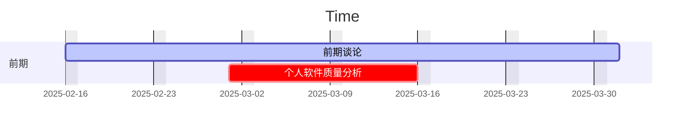

# Thryve
## 项目设计




### 面向文档类型

| 文档类型     | 对应功能                                |
| ------------ | --------------------------------------- |
| 图片         | 裁剪，色道分离                          |
| 表格         | 信息重组与提取                          |
| 基础数据文件 | 信息重组与提取                          |
| 文本文件     | 批量搜索与检阅编辑                      |
| pdf文件      | 页面分割等acrobat功能，再次探索加密功能 |
|              |                                         |


### 核心功能点

1. 对工作文件夹下面的所有文档进行批量处理
2. 支持图形化编程，利用类似蓝图的手段对各种文件进行操作
3. 优美的界面，流类型的工作流程，快速实现复杂的逻辑
3. 创建一个独属于自己的拓展名用于对工程文件的存储


### 创新功能点

1. 大模型接口的接入
2. 不同文档权限类型的管理
3. 对于文件夹树的深度优先搜索
4. 端对端的文件发送


### 选择技术栈


## 参考信息

### 相关开源库

https://github.com/1694439208/BluePrint

https://github.com/IgnorAnsel/QBlueprint

https://github.com/FlowiseAI/Flowise

https://github.com/leon-thomm/Ryven


### 技术栈建议

#### 核心架构
- **前端框架**: 推荐使用 **React + TypeScript**（生态丰富，社区活跃，适合复杂交互）
- **图形化编程界面**: 结合 **React Flow**（轻量级节点拖拽库） + **JointJS**（复杂连线逻辑处理）
- **UI 美化**: **Ant Design/Material-UI**（组件库） + **Styled Components**（动态样式）
- **跨平台支持**: **Electron**（桌面端）或 **Tauri**（轻量级 Rust 方案）

#### 后端与数据处理
- **核心语言**: **Python**（依赖丰富的文件处理库，如 Pillow、PyPDF2、pandas）
- **API 服务**: **FastAPI**（高性能异步框架，自动生成文档）
- **文件传输加密**: **SSL/TLS**（基础加密） + **Cryptography** 库（自定义加密逻辑）
- **权限管理**: **CASL**（声明式权限框架） + **RBAC 模型**

#### 文件处理技术
- **图片处理**: **OpenCV**（色道分离、裁剪） + **Pillow**（基础操作）
- **PDF 解析**: **PyMuPDF**（高性能解析） + **pdfplumber**（表格提取）
- **表格/数据文件**: **pandas**（结构化数据处理） + **Apache POI**（复杂 Excel 操作）
- **文本搜索**: **Whoosh**（轻量级全文检索引擎）或 **ElasticSearch**（分布式扩展）

#### 创新功能集成
- **大模型接口**: **LangChain**（流程编排） + **HuggingFace API**（本地模型部署）
- **文件树搜索**: **AnyTree**（可视化树结构） + **Watchdog**（实时监控文件变化）
- **端到端传输**: **WebSocket**（实时通信） + **ZeroMQ**（高性能消息队列）

---

#### 功能拓展性设计

##### 插件化架构

- 设计 **JSON Schema 节点协议**，允许用户自定义处理节点（如新增 "AI 去水印" 节点）
- 参考 Flowise 的 **模块动态加载机制**，支持第三方插件市场

##### 流程版本控制

- 集成 **Git 版本管理**，记录蓝图修改历史
- 提供 **快照回滚功能**，支持不同参数配置的对比测试

##### 分布式处理

- 通过 **Celery + Redis** 实现任务队列
- 支持将复杂流程拆解分发到多台机器执行（如大规模图片批量处理）

##### 智能增强

- **AI 预处理建议**: 上传文件后自动推荐可能的处理流程
- **语义化搜索**: 用向量数据库（如 **ChromaDB**）实现 "模糊需求->蓝图" 的转换

##### 安全扩展

- **动态水印注入**: 根据权限等级自动添加隐形水印
- **操作审计日志**: 记录用户的文件访问和修改行为

---

##### 推荐参考实现路径

1. **MVP 阶段**: 
   - 用 React Flow + FastAPI 实现基础节点拖拽
   - 优先支持图片/PDF处理（技术成熟度高）
2. **扩展阶段**: 
   - 引入 LangChain 实现 AI 增强功能
   - 开发 Electron 桌面客户端封装
3. **商业化阶段**: 
   - 增加团队协作功能（基于 CASL 的细粒度权限控制）
   - 提供云服务版（Docker + Kubernetes 部署）

建议参考 Ryven 的项目结构设计，其通过 `Session` 和 `Nodes` 的抽象实现了良好的扩展性，同时保持核心逻辑的简洁。

### `.thr` 文件设计建议

#### 核心定位

- **蓝图存档容器**：封装完整项目配置、节点拓扑、资源路径、用户自定义参数
- **可移植性强化**：通过相对路径和资源内嵌实现跨设备迁移
- **安全隔离层**：与操作系统解耦的独立沙盒环境

---

#### 技术实现方案

##### 文件格式选择

| 方案            | 优点                    | 缺点                 |
| --------------- | ----------------------- | -------------------- |
| **JSON**        | 易读/易调试/版本友好    | 冗余数据导致体积膨胀 |
| **MessagePack** | 二进制紧凑结构/快速解析 | 需要专用查看工具     |
| **SQLite**      | 支持事务/结构化查询     | 复杂度较高           |
| **Protobuf**    | 高效序列化/强版本兼容   | 需预定义Schema       |

**推荐组合方案**：
- 主文件用 **Gzip压缩的MessagePack**（兼顾效率与体积）
- 配套提供 **JSON导出工具**（用于调试和版本管理）

##### 数据结构设计
```yaml
# 元数据区
metadata:
  version: "2.3.1"            # 版本锁定
  uuid: "550e8400-e29b..."    # 唯一标识符
  created: "2025-02-20T08:00" 
  author: "user@domain"
  license: "CC-BY-NC-4.0"

# 资源索引
resources:
  - type: "Image"
    path: "assets/banner.png"
    checksum: "sha256:abcd..."
  - type: "ExternalScript"
    url: "https://example.com/plugin.py"

# 节点拓扑
nodes:
  - id: "node_23"
    type: "ImageProcessor"
    position: [120, 80]
    params:
      operation: "crop"
      area: [0,0,800,600]
    connections:
      input: ["node_12:output"]
      output: ["node_34:input"]

# 运行时状态
runtime:
  variables:
    threshold: 0.7
  breakpoints: ["node_34"]
  execution_log: [...]

# 扩展区（兼容未来升级）
extensions: 
  ai_assistant:
    last_prompt: "优化色彩平衡"
  custom_plugins: [...]
```

---

#### 创新功能集成

1. **智能压缩策略**
   - 对重复资源（如复用图片）自动启用 **DEFLATE 压缩**
   - 使用 **BSDiff 算法** 实现增量更新

2. **安全沙箱机制**
   - 敏感操作（如文件删除）需二次确认
   - 通过 **WebAssembly 隔离** 执行第三方插件

3. **时光胶囊特性**
   - 自动记录关键操作历史，支持 **版本对比回放**
   - 集成 **Merkle Tree** 校验文件完整性

4. **跨工程引用**
   ```hhy
   imports:
     - project: "libs/image_utils.hhy"
       components: ["ColorSpaceConverter"]
   ```

---

####  配套工具链建议

1. **命令行工具**
   ```bash
   hhy-tool analyze project.hhy     # 文件诊断
   hhy-tool export --format json    # 格式转换
   hhy-tool merge base.hhy patch.hy # 差异合并
   ```

2. **可视化分析器**
   - 提供 **3D 拓扑图展示**（基于 Three.js）
   - **资源热力图分析**（识别臃肿部分）

3. **云同步接口**
   - 通过 **RESTful API** 实现工程备份/恢复
   - 支持 **IPFS 分布式存储** 选项

---

#### 实现路线图

1. **初级阶段**：基于 JSON Schema 定义核心结构
2. **中级阶段**：引入 MessagePack 压缩优化
3. **高级阶段**：实现沙箱安全机制与版本追溯
4. **生态阶段**：发布 SDK 促进第三方工具集成

建议参考 Unity3D 的 `.unity` 文件设计思路，其通过 **YAML + 资源包** 的混合架构既保证了可读性，又实现了高性能资源管理。
